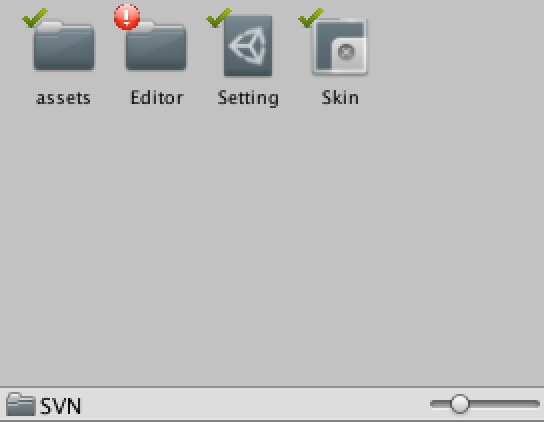

# UnitySVN
 This is a Unity SVN GUI Plugin.Before using this plugin, *UnityShellHelper* should be imported first.
 
 It's still in developing.

Support Now:
-  svn update
-  svn commit
-  svn status

